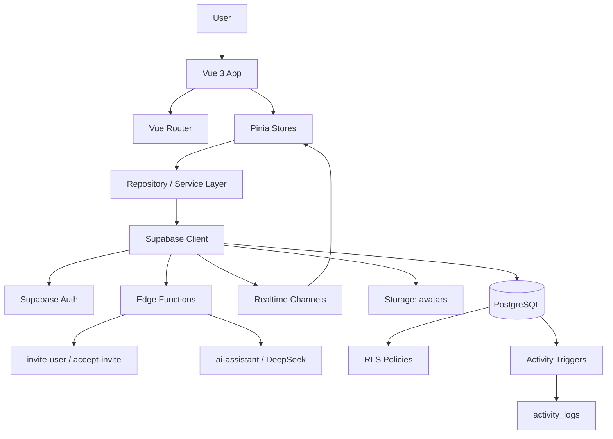

# Realtime Kanban

[](https://vuejs.org/)
[](https://vitejs.dev/)
[](https://pinia.vuejs.org/)
[](https://supabase.com/)
[](#known-issues--roadmap)
[](#license)

Realtime Kanban - Vue 3 + Supabase приложение для совместной работы с канбан-досками. Проект использует Pinia для состояния, Vue Router для маршрутов, Supabase Auth/Postgres/RLS/Realtime для backend-слоя и Edge Functions для инвайтов и AI Assistant. Кодовая база уже содержит production-like структуру, но часть возможностей остается в статусе "нужно проверить/доработать", что отдельно отмечено ниже.

## Содержание

- [Возможности](#возможности)
- [Архитектура](#архитектура)
- [Структура проекта](#структура-проекта)
- [Роли команды](#роли-команды)
- [Стратегия конфликтов](#стратегия-конфликтов)
- [Быстрый старт](#быстрый-старт)
- [Supabase setup](#supabase-setup)
- [Scripts](#scripts)
- [Permissions / RLS](#permissions--rls)
- [Known issues / Roadmap](#known-issues--roadmap)
- [Contribution](#contribution)

## Возможности

| Область | Статус | Что найдено в коде |
|---|---:|---|
| Авторизация | Реализовано | Supabase Auth: login, register, forgot password, auth listener, protected routes. |
| Профили | Реализовано | `profiles`, отображаемое имя, avatar URL, загрузка аватара в Storage bucket `avatars`. |
| Канбан-доски | Реализовано | Список досок, создание доски, выбор текущей доски, board-scoped routes. |
| Колонки | Реализовано | Таблица `columns`, default columns, загрузка и realtime-обновление колонок. |
| Карточки | Реализовано | Создание, редактирование, drag-and-drop/move, soft delete через `status = deleted`. |
| Участники | Реализовано | `board_members`, загрузка участников, роли `owner`, `editor`, `viewer`. |
| Инвайты | Реализовано, требует проверки в Supabase окружении | Создание приглашений через Edge Function `invite-user`, pending invites, accept/decline через RPC, revoke. |
| Уведомления | Частично | `/bonus/notifications` показывает pending board invites и локальный массив notifications из UI store. |
| Realtime-синхронизация | Реализовано, требует multi-tab/manual QA | Board-scoped `postgres_changes` для boards/cards/columns/activity/board_members, fallback через activity payloads. |
| Activity logs | Реализовано | `activity_logs`, триггеры карточек, ручные логи для invite actions, activity page и rail. |
| Комментарии | Реализовано, optional schema | `card_comments`, drawer UI, CRUD через repository, realtime subscription если optional table подтверждена. |
| Checklist items | Реализовано, optional schema | `card_checklist_items`, AI-generated subtasks можно сохранить в карточку. |
| Offline queue | Частично | Локальная очередь create/update/move/delete карточек при offline; требует дополнительного QA. |
| Search | Частично | Поиск по карточкам выбранной доски на клиенте после загрузки данных. |
| AI Assistant | Опционально | Edge Function `ai-assistant` вызывает DeepSeek server-side через `DEEPSEEK_API_KEY`. |
| Локализация RU/EN | Частично | `src/services/localization.js`, часть экранов локализована; в отдельных компонентах есть mojibake/смешанный текст. |

## Архитектура

### Frontend

Frontend построен как Vite-приложение на Vue 3:

- `src/main.js` создает Vue app, подключает Pinia и Vue Router.
- `src/App.vue` инициализирует auth store и рендерит `RouterView`.
- `src/layouts/AppShell.vue` содержит рабочую оболочку: `TopBar`, board-local `ActivityRail`, workspace `RouterView`, `TaskDrawer`, `ToastStack`.
- `src/router/index.js` описывает публичные auth routes и защищенные workspace routes.
- Pinia stores держат состояние auth, boards, cards, members и UI.
- Services/repositories из `src/services` являются единственным слоем доступа к Supabase и Edge Functions.

### Backend / Supabase

Backend-часть находится в `supabase/`:

- PostgreSQL schema задается миграциями.
- RLS включен для основных таблиц.
- RPC функции отвечают за создание доски, перемещение карточек, undo, accept/decline инвайтов.
- Realtime publication включает основные таблицы доски и optional таблицы.
- Edge Functions:
  - `invite-user` - создание приглашения с проверкой роли.
  - `accept-invite` - принятие приглашения по token.
  - `ai-assistant` - server-side вызов DeepSeek.



### Основные stores

| Store | Назначение |
|---|---|
| `auth` | Сессия Supabase, текущий пользователь, профиль, текущая роль на доске, permissions getters. |
| `boards` | Список досок, выбранная доска, колонки, настройки доски. |
| `cards` | Карточки, drawer selection, CRUD, drag-and-drop move, offline queue, realtime subscription, comments/checklists. |
| `members` | Участники, приглашения, presence state, роли, member management. |
| `ui` | Activity events, pending invitations for notifications, toasts, sync state, theme. |

## Структура проекта

```text
realtime-kanban/
├─ src/
│  ├─ assets/
│  │  ├─ img/
│  │  └─ styles/
│  ├─ components/
│  │  ├─ ActivityRail.vue
│  │  ├─ TaskCard.vue
│  │  ├─ TaskDrawer.vue
│  │  ├─ ToastStack.vue
│  │  ├─ TopBar.vue
│  │  └─ UserAvatar.vue
│  ├─ layouts/
│  │  └─ AppShell.vue
│  ├─ router/
│  │  ├─ guards.js
│  │  └─ index.js
│  ├─ services/
│  │  ├─ activityRepository.js
│  │  ├─ aiAssistantService.js
│  │  ├─ boardRepository.js
│  │  ├─ cardRepository.js
│  │  ├─ checklistRepository.js
│  │  ├─ commentRepository.js
│  │  ├─ memberRepository.js
│  │  ├─ profileRepository.js
│  │  ├─ realtimeService.js
│  │  └─ supabaseClient.js
│  ├─ stores/
│  │  ├─ auth.js
│  │  ├─ boards.js
│  │  ├─ cards.js
│  │  ├─ members.js
│  │  └─ ui.js
│  ├─ views/
│  │  ├─ ActivityView.vue
│  │  ├─ AiAssistantView.vue
│  │  ├─ AuthView.vue
│  │  ├─ BoardsView.vue
│  │  ├─ BoardView.vue
│  │  ├─ MembersView.vue
│  │  ├─ NotificationsView.vue
│  │  ├─ OfflineView.vue
│  │  ├─ ProfileView.vue
│  │  ├─ SearchView.vue
│  │  └─ SettingsView.vue
│  ├─ App.vue
│  └─ main.js
├─ supabase/
│  ├─ functions/
│  │  ├─ accept-invite/
│  │  ├─ ai-assistant/
│  │  └─ invite-user/
│  ├─ migrations/
│  └─ seed.sql
├─ tools/
├─ ARCHITECTURE.md
├─ MIGRATION_CHECKLIST.md
├─ PRODUCT.md
├─ package.json
├─ vercel.json
└─ vite.config.js
```

### Назначение ключевых директорий

| Директория | Назначение |
|---|---|
| `src/components` | Переиспользуемые Vue-компоненты: top bar, карточка, drawer, rail, toast stack. |
| `src/views` | Страницы приложения, привязанные к маршрутам Vue Router. |
| `src/stores` | Pinia stores и основная клиентская бизнес-логика состояния. |
| `src/services` | Repository/service слой для Supabase, Edge Functions, Realtime и optional tables. |
| `src/assets/styles` | Design tokens и глобальные CSS-правила. |
| `supabase/migrations` | SQL schema, RLS, triggers, RPC, realtime publication, storage policies. |
| `supabase/functions` | Deno Edge Functions для инвайтов и AI Assistant. |
| `tools` | Локальные audit/check scripts. |

## Роли команды

В коде нет явного распределения ответственности между участниками, поэтому ниже - рекомендуемая модель владения зонами проекта.

| Участник | Рекомендуемая зона ответственности |
|---|---|
| Прищепный Никита | Frontend / UI / UX: Vue views/components, responsive layout, дизайн-система, доступность, локализация. |
| Наумов Никита | Supabase / Database / RLS: schema, migrations, RLS policies, RPC, Edge Functions, Storage. |
| Пьянов Максим | Realtime / Collaboration / QA: realtime subscriptions, conflict handling, multi-tab сценарии, тесты, ручная проверка совместной работы. |

## Стратегия конфликтов

Проект рассчитан на совместную работу нескольких пользователей с сервером как источником истины.

### Что уже реализовано в коде

- Realtime updates:
  - подписка на `boards`, `cards`, `columns`, `activity_logs`, `board_members`;
  - optional подписки на `card_checklist_items` и `card_comments`, если таблицы подтверждены;
  - board work surface обновляется через прямые card/column events и fallback из `activity_logs`.
- Optimistic UI:
  - создание, редактирование, перемещение и удаление карточек сначала меняют Pinia state;
  - при ошибке store откатывает snapshot.
- Server as source of truth:
  - CRUD карточек сохраняется в Supabase;
  - move выполняется через RPC `move_card`;
  - activity logs пишутся триггерами и repository/Edge Function кодом.
- Защита от конфликтов:
  - `cards.version` используется в update/delete/move;
  - drawer передает `expectedVersion`;
  - при conflict store показывает conflict state и предлагает принять latest/оставить draft на уровне UI.
- Drag-and-drop:
  - локально пересчитываются позиции;
  - серверный `move_card` нормализует позиции в колонках и проверяет `expectedVersion`.
- Ограничения по ролям:
  - `owner` и `editor` могут менять карточки;
  - `viewer` видит доску read-only;
  - RLS дублирует ограничения на уровне базы.

### Что требует доработки или проверки

- Нужна ручная multi-user проверка в реальном Supabase проекте: две сессии/два браузера, create/move/update/delete.
- UI разрешения и RLS должны проверяться вместе: frontend блокирует действия, но итоговое право должно подтверждаться RLS/RPC.
- Conflict UX есть, но сценарий "keep mine" не выполняет полноценный merge/retry поверх latest версии.
- Realtime presence есть через Supabase presence state, но это не полноценная система locks; locks state в store присутствует, но не подключен к backend.
- Offline queue есть, но требует отдельного тестирования конфликтов после reconnect.

## Быстрый старт

### 1. Clone

```bash
git clone <repo-url>
cd realtime-kanban
```

### 2. Install dependencies

```bash
npm install
```

### 3. Create `.env`

Создайте `.env` в корне проекта:

```env
VITE_SUPABASE_URL=your_supabase_url
VITE_SUPABASE_ANON_KEY=your_supabase_anon_key
```

Дополнительно поддерживаются:

```env
VITE_SUPABASE_PUBLISHABLE_KEY=your_supabase_publishable_key
VITE_SUPABASE_AVATAR_BUCKET=avatars
```

> Не коммитьте реальные ключи проекта. Для Supabase anon/publishable key RLS остается обязательной границей безопасности.

### 4. Apply Supabase migrations

Если используется Supabase CLI:

```bash
supabase link --project-ref your-project-ref
supabase db push
```

Для локального Supabase:

```bash
supabase start
supabase db reset
```

### 5. Deploy Edge Functions

Инвайты используют Edge Functions:

```bash
supabase functions deploy invite-user
supabase functions deploy accept-invite
```

AI Assistant опционален:

```bash
supabase secrets set DEEPSEEK_API_KEY=your_deepseek_key
supabase functions deploy ai-assistant
```

### 6. Start dev server

```bash
npm run dev
```

### 7. Build

```bash
npm run build
```

### 8. Preview production build

```bash
npm run preview
```

### 9. Deploy на Vercel

Проект содержит `vercel.json` с SPA rewrite на `index.html`.

1. Импортируйте репозиторий в Vercel.
2. Укажите build command: `npm run build`.
3. Укажите output directory: `dist`.
4. Добавьте environment variables:
   - `VITE_SUPABASE_URL`
   - `VITE_SUPABASE_ANON_KEY`
   - при необходимости `VITE_SUPABASE_PUBLISHABLE_KEY`
   - при необходимости `VITE_SUPABASE_AVATAR_BUCKET`
5. Задеплойте проект.

## Supabase setup

### Таблицы и view

| Entity | Назначение |
|---|---|
| `profiles` | Профили пользователей, связанные с `auth.users`. |
| `boards` | Доски. |
| `board_members` | Участники досок и роли `owner/editor/viewer`. |
| `columns` | Колонки доски. |
| `cards` | Карточки, позиции, статусы, version для optimistic conflict control. |
| `activity_logs` | История изменений и источник activity rail/page. |
| `board_invites` | Физическая таблица приглашений. |
| `board_invitations` | Security-invoker view поверх `board_invites`. |
| `card_checklist_items` | Optional checklist/subtasks для карточек. |
| `card_comments` | Optional комментарии карточек. |
| `storage.objects` bucket `avatars` | Публичные аватары пользователей. |

### Миграции

| Файл | Назначение |
|---|---|
| `001_extensions.sql` | PostgreSQL extensions. |
| `002_core_schema.sql` | Базовые таблицы: profiles, boards, board_members, columns, cards, activity_logs, board_invites. |
| `003_constraints_indexes.sql` | Индексы и constraints. |
| `004_helpers.sql` | Helper functions/triggers, включая updated_at и role helpers. |
| `005_rls_policies.sql` | Базовые RLS policies. |
| `006_realtime.sql` | Добавление boards/columns/cards/activity_logs в `supabase_realtime`. |
| `007_activity_triggers.sql` | Триггеры activity logs для карточек. |
| `008_rpc_move_card.sql` | RPC `move_card`. |
| `009_rpc_undo.sql` | RPC `undo_last_action`. |
| `010_invites.sql` | Первичная invite модель и RPC accept by token. |
| `011_create_board_rpc.sql` | RPC `create_board`. |
| `20260611000000_ai_assistant.sql` | AI fields на cards и `card_checklist_items`. |
| `20260612000000_final_audit_hardening.sql` | `card_comments`, RLS и realtime publication для comments. |
| `20260612001000_board_member_profile_rls.sql` | Дополнительные RLS/profile policies для участников. |
| `20260612002000_auth_user_profile_trigger.sql` | `handle_new_user` trigger для `auth.users`. |
| `20260612003000_skip_card_delete_activity_on_board_delete.sql` | Уточнение card activity при удалении доски. |
| `20260612004000_avatar_storage_bucket.sql` | Storage bucket `avatars` и policies. |
| `20260612005000_invitation_notifications.sql` | Decline/revoke invites, pending unique index, RLS, accept/decline RPC, activity logs. |

### Что включить в Supabase

- Auth: email/password provider.
- Database migrations из `supabase/migrations`.
- Realtime для таблиц, добавленных в publication.
- Storage bucket `avatars` или применить migration `20260612004000_avatar_storage_bucket.sql`.
- Edge Functions:
  - `invite-user`;
  - `accept-invite`;
  - `ai-assistant`, если нужен AI Assistant.
- Secrets для Edge Functions:
  - `SUPABASE_URL`;
  - `SUPABASE_ANON_KEY`;
  - `SUPABASE_SERVICE_ROLE_KEY`;
  - `DEEPSEEK_API_KEY` только для `ai-assistant`.

## Scripts

Команды взяты из `package.json`.

| Команда | Назначение |
|---|---|
| `npm install` | Установка зависимостей. |
| `npm run dev` | Запуск Vite dev server. |
| `npm run build` | Production build. |
| `npm run preview` | Preview собранного `dist`. |
| `npm run test` | Запуск Vitest test suite. |
| `npm run lint` | Запуск `node tools/audit-js.mjs`. |
| `npm run check` | Alias на `npm run build`. |

## Permissions / RLS

### Роли

| Роль | Возможности в UI | Ограничения в RLS/RPC |
|---|---|---|
| `owner` | Управление доской, участниками, ролями, карточками, колонками, инвайтами. | Может обновлять/удалять доску, управлять `board_members`, создавать/обновлять invites. |
| `editor` | Создание и редактирование карточек, перемещение карточек, создание инвайтов. | Может менять cards/columns и создавать invites, если policy/RPC разрешает. |
| `viewer` | Просмотр доски, карточек, activity, участников. | Read-only: select для board-scoped данных, без mutations. |

### Модель доступа

- `board_members` является главным источником доступа к доске.
- `boards`, `columns`, `cards`, `activity_logs` читаются только участниками доски.
- `cards` и `columns` изменяются только `owner`/`editor`.
- `board_members` управляется владельцем.
- `board_invites`:
  - owner/editor могут читать и создавать invites;
  - invited user может читать invite, если `lower(email) = lower(auth.email())`;
  - invited user может принять/отклонить только свой invite;
  - pending unique index предотвращает дубли активных приглашений на один email в одной доске.
- После принятия invite создается `board_members` row; после этого пользователь получает доступ к доске через обычные RLS policies.

## Known issues / Roadmap

### Уже готово

- Vue 3/Vite/Pinia app shell.
- Supabase Auth integration.
- Реальные boards/columns/cards/members/activity из Supabase.
- RLS migrations для основной модели.
- Board-scoped realtime subscriptions.
- Realtime board surface updates для card insert/update/delete/move.
- Invite notification flow: pending invites, accept, decline, revoke.
- Profile edit и avatar upload.
- Comments/checklists на карточке.
- AI Assistant через Supabase Edge Function.
- Vitest tests для auth guards, auth permissions, card repository, cards store, member repository.

### Нужно проверить

- Multi-user realtime сценарии в настоящем Supabase проекте:
  - Tab A создает карточку, Tab B видит ее без refresh;
  - Tab A двигает карточку, Tab B видит перемещение;
  - Tab A удаляет карточку, Tab B видит удаление.
- End-to-end invite flow с реальными пользователями и email matching.
- Storage policies для avatar bucket в deployed Supabase проекте.
- Edge Functions permissions и secrets.
- Vercel deployment с production env vars.

### Требует доработки

- Локализация: в отдельных файлах встречается mojibake/смешанный RU/EN текст.
- Presence/locks: presence state есть, но полноценные locks не подключены к backend.
- Conflict UX: есть version conflict detection, но нет полноценного merge/retry flow.
- Offline queue: работает как локальная очередь, но требует robust conflict handling после reconnect.
- Notifications: actionable invites работают, но общий массив `uiStore.notifications` пока не загружается из отдельной таблицы уведомлений.
- Статусы карточек требуют выравнивания: UI содержит `active/blocked/done`, а базовая SQL check-constraint в `002_core_schema.sql` задает `active/archived/deleted`.
- Analytics route остается placeholder.
- Нет отдельного `LICENSE` файла.
- `.env.example` должен содержать только шаблонные значения перед публикацией в open source.


4. Проверьте, что не закоммичены `.env`, `dist`, `node_modules` и реальные secrets.
5. Откройте pull request с кратким описанием:
   - что изменено;
   - как проверено;
   - есть ли миграции Supabase;
   - есть ли риски для RLS/realtime.

## License

В репозитории не найден отдельный файл лицензии. Перед публикацией проекта как open source нужно добавить `LICENSE` и указать выбранную лицензию в README/package metadata.
